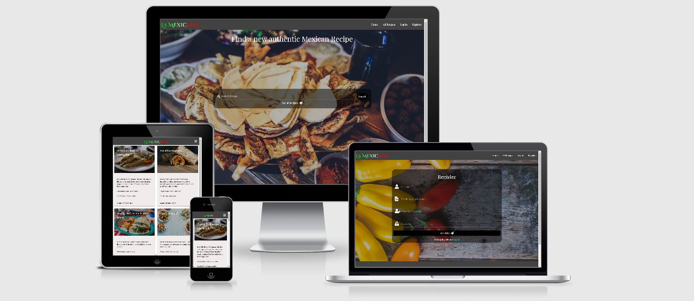

# LA MEXICANA

Mexican cuisine is one of the most sort after and popular types of cooking around the world. Not only for its extravagant and fiery taste but also the wide variety of options available. The purpose of this website is to bring these well-known dishes such as Tacos, Burritos and Quesadillas right to your kitchen. Designed for cooking enthusiasts and professional chiefs alike, La Mexicana provides a platform for the user to discover brand new exciting recipes or add one of their own.

## Table of Contents
* [UX](#ux)
* [User Stories](#user-stories)
* [Design](#design)
* [Wireframes](#wireframes)
* [Features](#features)
* [Technologies Used](#technologies-used)
* [Testing](#testing)
* [Deployment](#deployment)
* [Credits](#credits)

## UX 
The intention behind this website is to provide a platform for those interested in discovering new authentic Mexican recipes or those wanting to share one of their own recipes. Either someone with professional experience wanting to share their expertise or simply a cooking enthusiast wishing to broaden their horizons. 
 
 
The CRUD functionality of La Mexicana food app makes this platform ideal for finding and sharing new recipes. As this project is a MongoDB backed Flask project the user is able to create, read update and delete data about a particular recipe. The CRUD functionality also applies to the user profiles. Only registered users can edit their own recipes and profiles. Making it safe and secure due to the login system. All users are able to search all recipes on the app in the search bar. Categories aid the user’s search making it fast and easy to use.

## User Stories:

The target audience is for all ages and cultures. However, there are three types of users for this site with distinct user stories.

A Guest User

1.  As a guest user, I want to view all recipes without the need for registering.
2.	As a guest user, upon entering the site, I want to know what the website is about and what content is available to me.
3.	As a guest user, I want to learn about or access a specific Mexican recipe.
4.	As a guest user, I want to access the site’s social media pages. 
5.	As a guest user, I want to search for a recipe by category or name.
6.	As a guest user, I want to see the ingredients for each recipe.
7.	As a guest user, I want to read the method for preparing the dish.
8.	As a guest user, I want to learn the names of different recipes.
9.	As a guest user, I want to find out how long each recipe takes to prepare.
10.	As a guest user, I want to register and become a registered user.

 

A Registered User

1.	As a registered user, I want to log in to my account and receive confirmation.
2.	As a registered user I want to be able to add recipes.
3.	As a registered user, I want to be able to search recipes.
4.	As a registered user, I want to be able to delete the recipes that I have added.
5.	As a registered user, I want to be able to edit the recipes that I have added.
6.	As a registered user I want to be able to store my information in a password protected profile.
7.	As a registered user, I want to be able to receive confirmation when I have logged out of my account.
8.	As a registered user, I want to create a profile upon registering.
9.	As a registered user, I want to view the profile pages of other users.
10.	As a registered user, I want to edit the information on my profile page.
11.	As a registered user, I want to delete my profile page.

 

An Admin User

1.	As an admin user, I want to view all categories.
2.	As an admin user, I want to add a category.
3.	As an admin user, I want to edit a category.
4.	As an admin user, I want to delete a category.

 

## Design

The website design has been inspired by Code Institute’s Task Manger Project videos by Tim Nelson. As the site is simple and responsive and enables CRUD functionality. 

### Color Scheme
#### The main color scheme for Navigation bar and Footer are as follows:

#424242 For the Navigation Bar and Footer Background.
 
 
#fafafa For the Navigation and Social media links.
 
 
These two colors were chosen as they provide a nice modern look as well as an easy on the eye contrast to the other content on the page.  Landing images have been used on most page with a transparent overlay and white text on the overlay fields. This is to hold the User’s attention as well as showcase the variety of Mexican dishes available. 

The Card Panel background color is #f1ecec making the background more calming and a text color of #000 for clarity on the All Recipes and All Users page.

### Typography
The site uses two different fonts on all pages. Both are from Google Fonts and have been used as follows:
-	Cinzel Decorative 

 Used for the main logo at the top left of the base template. 
-	Playfair Display 

Used as the main font for all other text throughout the site. This also includes Nav links and the Footer.

## Wireframes:
Below are the wireframes which represent the initial design for each page on both desktop and mobile views.

-	[Base Template](static/images/wireframes/base-html.pdf)
-	[Home Page](static/images/wireframes/index-html.pdf)
-	[All Recipes](static/images/wireframes/all-recipes-html.pdf)
-	[Recipe Page](static/images/wireframes/recipe-html.pdf)
-	[Login](static/images/wireframes/login-html.pdf)
-	[Register](static/images/wireframes/register-html.pdf)
-	[Profile Page](static/images/wireframes/profile-html.pdf)
-	[All Users](static/images/wireframes/all-users-html.pdf)
-	[Add Recipe](static/images/wireframes/add-recipe-html.pdf)
-	[Update Recipe](static/images/wireframes/edit-recipe-html.pdf)
-	[Edit Profile](static/images/wireframes/edit-profile-html.pdf)

### Datebase:
MongoDB has been used to store the data for this site. The MongoDB database called la_mexicana contains 3 collection called recipes, categories and users. Each category and the corresponding data fields for this project are illustrated in the database schemas below.
 
[Database Schema](static/wireframes/wireframes.pdf)

## Features 
The site contains certain features which are not available to all user. Such features provide the CRUD operations on the user’s account and recipes. These have been restricted to the Admin user and registered users. All other content is available for all users to view.

#### Existing features Visible to all Users:

### Nav & Side Nav bar
Situated at the top-right of each page of the website the navigation links are represented as a burger icon on smaller media devices and standard navigation links on desktop screens. Enabling the user to access the pages most relevant to their needs with ease as well as providing an overview of the content available to the user on the other pages of the website. All the user has to do is to click on the links displayed in the navigation dropdown to browse the page of interest on the website. Certain links are restricted to registered users and can only be accessed once the user has registered and logged in.

### Footer  
At the bottom of each page of the website, the footer consists of social media icon links and a brief summary of the site. Here the user can access the site’s other social media accounts just by clicking on the different icons available.

### Landing page 
The landing/home page welcomes the user to the website and provides the user with a brief overview of the purpose of the site. A Search bar situated in the centre of the page provides the user upon entry to the site with the option of searching a specific recipe or viewing all recipes. This is for both those who have an idea what recipe they are looking for and those who are looking for something new.

### All Recipes
This page contains a brief overview of each of the recipes such as the name, recipe description, preparation time along with a responsive image of the recipe. The creator of the recipe is also detailed on each of the recipe preview cards. A link is situated at the bottom of each card labelled “more information” is where the user can select a specific recipe. 

### Recipes
Available to all users upon selecting the “more information” button on one of the recipe previews cards on the all-recipes page. On this page the user is presented with a list of ingredients, method and preparation time in more detail. A return button is situated at the bottom of the page enabling the user to return to the all-recipes page and view more recipes.

### Login
Visible to all users as a navigation link and enables registered users to access their profiles once the required input fields have been completed in the correct format. An error message will be shown to the user if the fields do not match the required format. For non-registered users an error message will be shown if the details are not matched on the database instructing the user to register.

### Register
Visible to all users as a navigation link and enables a new user to register and create a profile once the required input fields have been completed in the correct format with a registration confirmation message. An error message will be shown to the user if the fields do not match the required format. If the input data provided by the user already exists on the database then an error message will also be triggered to the user.

#### Existing features Visible to only registered users:

### Add Recipe
Visible to only registered users providing them with the option of adding their own recipe. Once all input fields and dropdown options are completed in the required format a confirmation message will be visible to the user with confirmation of the new recipe. An error message will be shown to the user if the fields do not match the required format.

### Update Recipe 
A button labelled “Update” on the user’s profile page. Provides access to the recipe update page which is only visible to registered users giving them the option of editing their own recipe. Once all input fields and dropdown options are completed in the required format a confirmation message will be visible to the user with confirmation of the recipe update. An error message will be shown to the user if the fields do not match the required format.

### Delete Recipe
A button labelled “Delete” on the user’s profile page is only visible to registered users giving them the option of deleting their own recipe.

### Profile
Once a registered user logs into their account the first page they visit is the Profile page which is specific to that individual user. Each profile page contains a welcome message upon entry and the name of the user along with a profile picture. Further information about the user can be added to this page by that specific user. Further down the page there is a collapsible drop down were information and a link is provided to the recipes created by that users.

### Edit Profile
Situated at the bottom of the in-session user’s profile page is a button labelled “Update Profile”. Upon clicking on the button, the user is directed to the edit profile page where all the existing input fields and input entries from the registration page are visible for editing. The update profile button is only visible to the in-session user and therefore no other user has the option to edit another user’s profile page.

### Delete Profile
At the bottom of the in-session user’s profile page is a button labelled “Delete Profile”. Upon clicking on the button, the user is directed to the registration page where a confirmation message is displayed confirming that the profile has been successfully deleted. The delete profile button is only visible to the in-session user and therefore no other user has the option to delete some other user’s profile page.

### All Users
This page contains a brief overview of each of the user’s profiles such as the name, information about the user along with a responsive profile image. This can be viewed by all registered users. From this page all registered users can access others profile pages by clicking on the link “More Information”. However, upon entry to the profile page no delete or update buttons are visible.

#### Existing features Visible to site admin only:

Currently there are six different categories which can be used to help the user search for a specific recipe. As the site increases in popularity it may become necessary to add more categories to enable the sorting of the data in to a more organized schema. There for the admin user has the ability to login and Mange the categories. 

### View Categories
Only visible to the admin user, this page provides a brief summary of all the current categories.

### Add Category
At the top of the current categories page there is a button labelled “Add Category”. Once the Admin user clicks on this button, they are redirected to the add category page where they must add a new category in an input field labelled “Category name". Once input is completed in the required format then a confirmation message will be visible to the user with confirmation of the new category. An error message will be shown to the user if the fields do not match the required format.

### Edit Category 
For each category on the all-categories page. There is a button labelled “Edit Category”. Once the Admin user clicks on this button, they are redirected to the edit category page where the existing category name in an input field labelled name will be visible for editing. Once the input is completed in the required format a confirmation message will be visible to the user with confirmation of the updated category. An error message will be shown to the user if the fields do not match the required format.

### Delete Category
For each category on the all-categories page. There is a red button labelled “Delete Category”. Once the Admin user clicks on this button a confirmation message will be visible to the user with confirmation the category has been deleted.

### Features Left to Implement:
Some features that may be implemented in the future are:

-	Functionality to like other user’s recipes.
-	A deleted section for the admin user. Therefore, all deleted items would need confirmation before deleting permanently.
-	A “forgot password” option on the login page, enabling the user to reset their password if they cannot remember their current password.
-	Functionality to share videos of the recipe being prepared.
-	Functionality to upload an image directly rather than copy and paste a current file path.
-	Pagination for the All Recipes and All Users page.
-	Radio buttons to be populated with current values for editing.

## Technologies Used

### Languages:
- [HTML5](https://en.wikipedia.org/wiki/HTML5) 
  
  The project uses HTML (Hyper Text Mark-up Language) as this is the standard mark-up language for structuring and presenting the content on webpages.
- [CSS3](https://en.wikipedia.org/wiki/CSS) 

  The project uses CSS (Cascading Style Sheets) as this describes how the HTML elements should be displayed on the webpages.
- [JQuery](https://jquery.com/)

  A JavaScript library was used in this project to create and control the dynamic parts of the website such as the contact forms, Nav links and the collapsible features.

- [Javascript](https://www.javascript.com/) 
  
  JavaScript was used in this project to create and control the dynamic parts of the website such as thepreloader.

- [Python](https://www.python.org/) 
    -	Flask  
    
    A micro python web framework.
    -	Flask_pymongo 
    
    An open-source database that stores flexible JSON-like documents.
    -	BSON 
    
    Binary JSON for representing complex data structures.
    -	Werkzeug 
    
    A comprehensive WSGI web applications library.
    -	Dnspython 
    
    A DNS toolkit for python.
    -	Jinja 
    
    A web template engine for the Python programming language.

### Integrated Development Environment:

- [Gitpod](https://gitpod.io/workspaces/) 

The website for this project was created using the online IDE Gitpod.

### Software Development Platform:

- [Github](https://github.com/) 

This project was saved in GitHub as a repository using GitHub’s hosting services

### Applications & Data storage:

- [MongoDB](https://www.mongodb.com/) 

A cross-platform document-orientated non-relational database program.

- [Amazon S3](https://aws.amazon.com/s3/)

An object storage service. For storing data and images.

- [Heroku](https://www.heroku.com/)

A platform service that enables developers to build, run and operate applications entirely in the cloud.

### Frameworks:

- [Materialize](https://materializecss.com/)

The project uses the Materialize framework for faster and easier web development. Materialize framework also allows us to create a responsive website with ease.

### Other Tools:

- [Google Fonts](https://fonts.google.com/)

The online library of licensed fonts was used in this project.

- [Font Awsome](https://fontawesome.com/)

The vast library of icons available from font awesome are used throughout this project to compliment texts and links making the design clearer and more concise.

- [Balsamiq](https://balsamiq.com/)

The industry standard wireframing tool was used at the start of this project to design and create a skeleton plan of each of the pages in this website on both desktop and mobile views.

### Validators:

- [HTML Validator](https://validator.w3.org/)
- [CSS Validator](https://jigsaw.w3.org/css-validator/)
- [Python Validator](http://pep8online.com/)
- [Javascript Validator](https://jshint.com/)
- [CSS Beautifier](https://www.cleancss.com/css-beautify/)

## Testing:

The following Web Development tools were used for this project for testing, debugging and optimising different variation of HTML, CSS and JavaScript. The Web Developer tools were also used to view the layout and structure of the website through different devices and to test the behaviour of the website on standard screen sizes to cover all media devices.
-	Chrome Developer Tools
-	DevTools (Firefox)
-	CSS Validator (Jigsaw)
-	HTML Validator (NU)
-	Javascript Validator (Beautify Tools)
 
This website has been tested on the following devices:
-	Moto G4
-	Galaxy S5
-	Pixel 2
-	iPhone 5/SE
-	iPhone 6/7/8
-	iPhone 6/7/8 Plus
-	iPhone X
-	iPad
-	iPad Pro

### Testing User Stories
In this section, we will go over some of the user stories from the UX section and ensure that they all work as intended, with the project providing an easy and straightforward way for the users to achieve their goals. The testing will focus on the Create, Read, Update and Delete functionality for each of the User stories.

#### Guest User
*As a guest user, I want to view all recipes without the need for registering (Read Functionality).*
-	Click on the link to the "All Recipes" page which is one of the links in the navigation bar. Please note, the link is in the navigation bar dropdown which can be activated by clicking on the burger icon at the top right-hand side of the page on smaller devices. 
-   Scroll down the page to view the previews of all recipes.

*As a guest user, I want to learn about or access a specific Mexican recipe. (Read Functionality).*
-	Click on the link to the "All Recipes" page which is one of the links in the navigation bar
-	Scroll down the page to view the previews of all recipes.
-	Click on the “More Information” link of the recipe of interest to be viewed in more detail.
-	This process can be repeated in mobile views. Please note, the link is in the navigation bar dropdown which can be activated by clicking on the burger icon at the top right-hand side of the page

*As a guest user, I want to search for a recipe by category or name (Read Functionality).*
-	Go to the search bar in the centre of the Home page.
-	Type the recipe name or category of interest and click the button labelled “Search”.
-	A list or recipes relevant to the search input will be displayed.

*As a gust user, I wish to register and become a registered user (Create Functionality).*
-	Click on the link to the "Register" page which is one of the links in the navigation bar. 
-	Complete the input fields and dropdowns in the required format.
-	If an error message saying “Username already exits” appears please try a different username.
-	Once all field have been completed and there are no error messages, click on the button labelled “Register” at the bottom of the form.
-	A message will appear confirming the successful registration and the user will be redirected to the created profile page.
-	This process can be repeated in mobile views. Please note, the link is in the navigation bar dropdown which can be activated by clicking on the burger icon at the top right-hand side of the page

#### Registered User:

*As a registered user I want to be able to add recipes (Create functionality).*
-	Click on the link to the "Add Recipe" page which is one of the links in the navigation bar. 
-	Complete the input fields and dropdowns in the required format.
-	Once all fields have been completed and there are no error messages, click on the button labelled “Add Recipe” at the bottom of the form.
-	A message will appear confirming the recipe has successfully been created and will be displayed on the All Recipes page.
-	This process can be repeated in mobile views. Please note, the link is in the navigation bar dropdown which can be activated by clicking on the burger icon at the top right-hand side of the page

*As a registered user, I want to be able to search recipes (Read functionality).*
-	Go to the search bar in the centre of the Home page.
-	Type the recipe name or category of interest and select the button labelled “Search”.
-	A list or recipes relevant to the search input will be displayed.

*As a registered user, I want to be able to delete the recipes that I have added (Delete functionality).*
-	Click on the link to the "Profile" page which is one of the links in the navigation bar. 
-	Scroll down to the collapsible dropdown labelled “My Recipes”. Select the recipe for editing in the list and a button labelled “Delete” will be visible to the in-session user.
-	A message will appear confirming the recipe has successfully been deleted.
-	This process can be repeated in mobile views. Please note, the link is in the navigation bar dropdown which can be activated by clicking on the burger icon at the top right-hand side of the page

*As a registered user, I want to be able to edit the recipes that I have added (Update functionality).*
-	Click on the link to the "Profile" page which is one of the links in the navigation bar. 
-	Scroll down to the collapsible dropdown labelled “My Recipes”. Select the recipe for editing in the list and a button labelled “Update” will be visible to the in-session user.
-	Edit the current content in the input fields and dropdowns in the required format.
-	Once all fields have been completed and there are no error messages, click on the button labelled “Update Recipe” at the bottom of the form.
-	A message will appear confirming the recipe has successfully been updated.
-	This process can be repeated in mobile views. Please note, the link is in the navigation bar dropdown which can be activated by clicking on the burger icon at the top right-hand side of the page

*As a registered user, I want to create a profile upon registering (Create Functionality).*
-	Click on the link to the "Register" page which is one of the links in the navigation bar. 
-	Complete the input fields and dropdowns in the required format.
-	If an error message saying “Username already exits” appears please try a different username.
-	Once all input fields have been completed and there are no error messages, click on the button labelled “Register” at the bottom of the form.
-	A message will appear confirming the successful registration.
-	This process can be repeated in mobile views. Please note, the link is in the navigation bar dropdown which can be activated by clicking on the burger icon at the top right-hand side of the page

*As a registered user, I want to view the profile pages of other users (Read Functionality).*
-	Click on the link to the "All Users" page which is one of the links in the navigation bar. 
-	Scroll down the page to view the previews of all the user profiles.
-	Click on the “More Information” link of the User profile of interest to be viewed in more detail.
-	This process can be repeated in mobile views. Please note, the link is in the navigation bar dropdown which can be activated by clicking on the burger icon at the top right-hand side of the page

*As a registered user, I want to edit the information on my profile page (update functionality).*
-	Click on the link to the "Profile" page which is one of the links in the navigation bar. 
-	Scroll down to the bottom of the page.  Click the button labelled “Edit Profile” which is only visible to the in-session user.
-	Edit the current content in the input fields and dropdowns in the required format.
-	Once all field have been completed and there are no error messages, click on the button labelled “Update Profile” at the bottom of the form.
-	A message will appear confirming the Profile has successfully been updated.
-	This process can be repeated in mobile views. Please note, the link is in the navigation bar dropdown which can be activated by clicking on the burger icon at the top right-hand side of the page.

*As a registered user, I want to delete my profile page (Delete Functionality).*
-	Click on the link to the "Profile" page which is one of the links in the navigation bar. 
-	Scroll down to the bottom of the page.  Click the button labelled “Delete Profile” which is only visible to the in-session user.
-	A message will appear confirming the Profile has successfully been deleted and the user will be redirected to the Registration page.
-	This process can be repeated in mobile views. Please note, the link is in the navigation bar dropdown which can be activated by clicking on the burger icon at the top right-hand side of the page.

#### Admin User
*As an admin user, I want to view all categories (Read Functionality).*
-	Click on the link to the "Categories" page which is one of the links in the navigation bar. 
-	Scroll down the page to view the list of all categories. 
-	This process can be repeated in mobile views. Please note, the link is in the navigation bar dropdown which can be activated by clicking on the burger icon at the top right-hand side of the page.

*As an admin user, I want to add a category (Create Functionality)*
-	Click on the link to the "Categories" page which is one of the links in the navigation bar. Please note, the link is in the navigation bar dropdown which can be activated by clicking on the burger icon at the top right-hand side of the page. 
-	Click on the button at the top of the page labelled “Add New Category”.
-	Complete the input field in the required format.
-	Once the field has been completed and there are no error messages, click on the button labelled “Add Category” at the bottom of the form.
-	A message will appear confirming the Category has successfully been created.
-	This process can be repeated in mobile views. Please note, the link is in the navigation bar dropdown which can be activated by clicking on the burger icon at the top right-hand side of the page.

*As an admin user, I want to edit a category (Update Functionality).*
-	Click on the link to the "Categories" page which is one of the links in the navigation bar. 
-	Scroll down the page to view the list of all categories. 
-	Click on the button labelled “Edit” for the category that is to be updated.
-	Edit the current content in the input field in the required format.
-	Once the field has been completed and there are no error messages, click on the button labelled “Update” at the bottom of the form.
-	A message will appear confirming the Category has successfully been updated.
-	This process can be repeated in mobile views. Please note, the link is in the navigation bar dropdown which can be activated by clicking on the burger icon at the top right-hand side of the page.

*As an admin user, I want to delete a category (Delete Functionality).*
-	Click on the link to the "Categories" page which is one of the links in the navigation bar. 
-	Scroll down the page to view the list of all categories. 
-	Click on the button labelled “Delete” for the category that is to be Deleted.
-	A message will appear confirming the Category has successfully been deleted and the user will be redirected to the Categories page.
-	This process can be repeated in mobile views. Please note, the link is in the navigation bar dropdown which can be activated by clicking on the burger icon at the top right-hand side of the page.

### Defensive Testing:
Login Validation
-	The error message “Incorrect Username and /or Password” is shown inhibiting the unregistered user from guessing the Username or Password and brute forcing their way into a user’s profile.

Registration Validation

-	The error message “Username already exists” inhibits the unregistered user from creating a duplicate profile.

In session User:

A registered user can only update and delete their own recipes and profile page. Only the admin user is able to access, edit and delete the categories. 

### Interesting bugs or problems
No major bugs or problems were encountered during the making of this project. Any issues that were encountered were only minor ones such as the mistyping of code and white spaces between elements.

Several minor problems encountered are listed below:

A recipe called Test was created to catch any errors. Upon viewing the results, the Ingredient table was correctly updated on MongoDB database but not on correctly rendered on the individual template for the recipe page. This was due to a Jinja syntax error on the recipe page where the ingredients name was called recipes.ingredients_list on the template instead of recipes.ingredients.

During the same test the values for the preparation time and difficulty of a created recipe were not being updated in to MongoDB with the values used in the Test input fields. Both the select dropdowns and radio buttons for the Difficulty and preparation time did not have the value attribute for each option. Therefore, no values were being selected when a recipe was being created. The value attributes were added to each corresponding option in the select field and the test was rerun and the MongoDB was correctly updated.

## Deployment
This project was developed with the use of Gitpod’s Intergraded Development Environment. All developments and changes made to the project were saved and pushed to an external repository stated below using GitHub. The project was then deployed to Heroku and automated pushes to the GitHub account were also applied to the Heroku account.

### Local Deployment:

-	Go to Milestone-3 Repository in Github.
-	Click on the button labelled “Code”.
-	Then Click on Download Zip in the dropdown.
-	Unzip the downloaded file.
-	In the command line type pip -r requirements.txt 
-	Create a free account in MongoDB and create the database following the Collections Schema PDF 
-	Create an env.py file and add the Mongo_URI and the Secret_Key
-	To run the type python3 app.py in the command line.

### Deployment to Heroku:

-	Create a requirements.txt by typing in the terminal command line: pip3 freeze --local > requirements.txt
-	Create a Procfile by typing in the terminal command line with: echo web: python app.py > Procfile.
-	Use git add -A, Git commit -m & Git push to push these changes into GitHub.
-	Navigate to the Heroku website
-	Create a new app by selecting the button labelled “New” on the dashboard and give the app a unique name.
-	Set a region closets to your current location.
-	Select Github in the deploy tab
-	Type in the name of the repository you wish to connect
-	Click on Reveal Config Vars and set as below:
  - IP = 0.0.0.0
  - MONGO_DBNAME = [name of MongoDB]
  - 
  add MONGO_URI and SECRET_KEY.
-	Go to the Deploy tab and select Enable Automatic Deploys then click on Deploy Branch, ensuring the master branch is selected.

## Credits:

### Content
The python code in this project along with the database design and templates has been based on The Task Manger Mini project by Code institute.

The recipes featured in this project have been taken from the following websites:

-	https://www.delish.com/
-	https://www.myrecipes.com/mexican-recipes 
-	https://www.mexicanplease.com/
-	https://www.bbcgoodfood.com/recipes/collection/mexican-recipes
-	https://mexicanfoodjournal.com/authentic-mexican-recipes/

### Media
All the recipe images and profile page images have been taken from the following:

- [Pexels](https://www.pexels.com/)

### Acknowledgements
-	Allen Thomas Varghese (Code Institute mentor) Thank you for your advice and guidance throughout this project helping improve the design and over function of the website.
-	Code Institute Slack Community Thank you for your guidance with any queries or problems I have encountered during the making of this website.
-	Tim Nelson (Code Institute) Thank you for the clear and concise video in the mini project which helped me understand the basics of python and templating.

